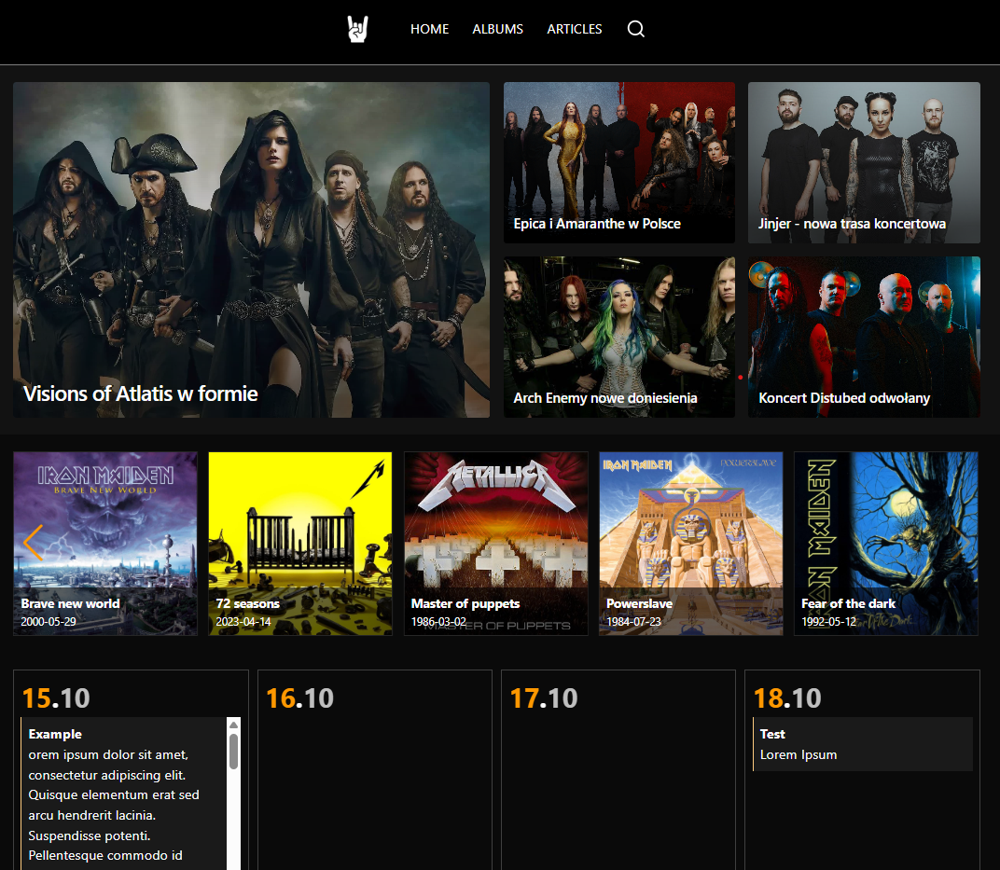

# HEAVY METAL PORTAL
## About the project
The project is purely etesting, and its main purpose was to demonstrate my programming skills. Both the code and the layout are entirely my own work. For convenience, I used Inertia here, although I usually **try to avoid building monoliths**. Since this is only a test application, I didn’t write as many tests as I would for a production-grade project. **I simply wanted to show that I am capable of writing tests.**


### Stack
* Laravel 12
* sqlite (in developer version)
* Inertia
* React
* TipTap
* React Select
* Tailwind
* Dark and light layout
### About the author
Programmer and UX: Michał Pruchniak

## How to run the project?
1. Clone the project
```
git clone https://github.com/michalpruchniak/heavy-metal-portal.git
cd heavy-metal-portal
```
2. Rename .env.example file to .env and add in formations about admin account, for example:
```
ADMIN_NAME="Admin"
ADMIN_EMAIL="test@test.pl"
ADMIN_PASSWORD="password"
```
Seeder will create an admin account based on this data.
3. Install dependencies
```
composer install
npm install
```
4. Run migrations and seeder
```
php artisan migrate --seed
```
5. Generate new key
```
php artisan key:generate
```
6. Run the project
```
composer run dev
```
And now you can go to **localhost:8000**.
